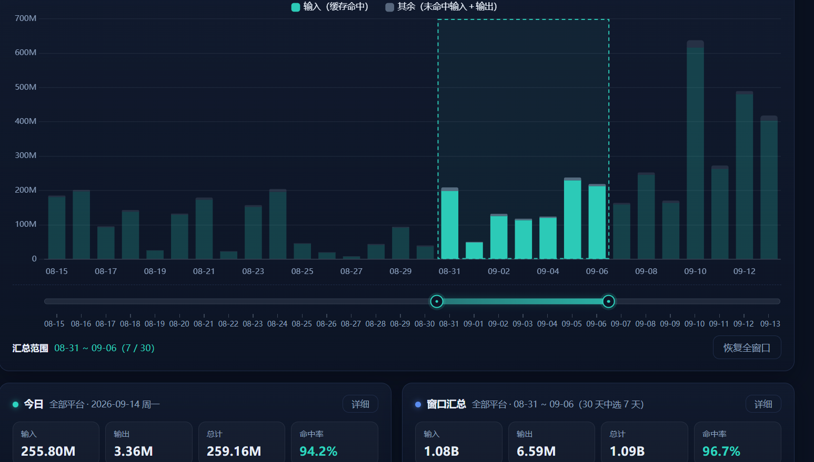
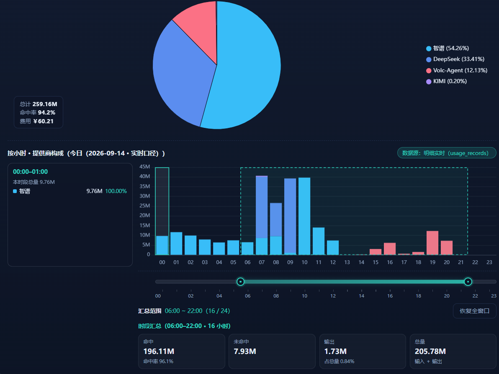
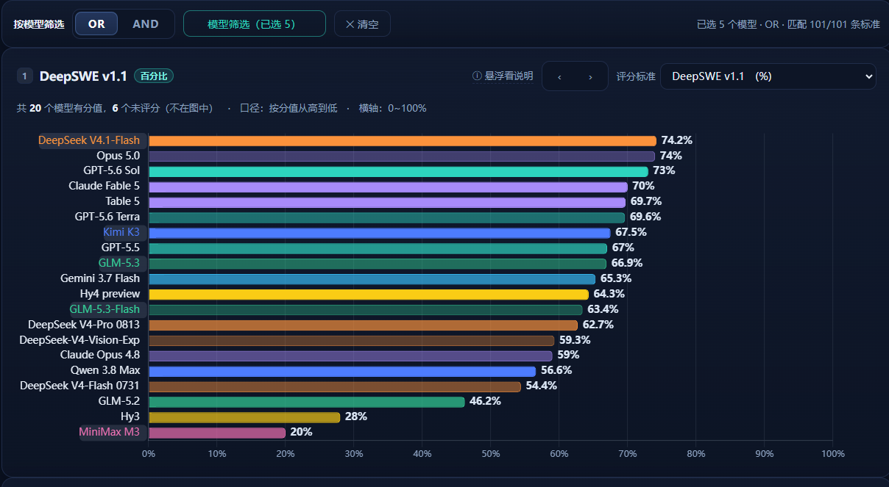
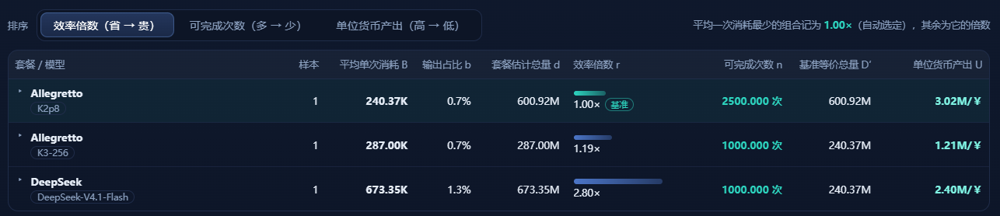
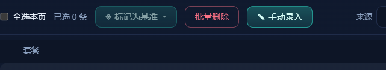
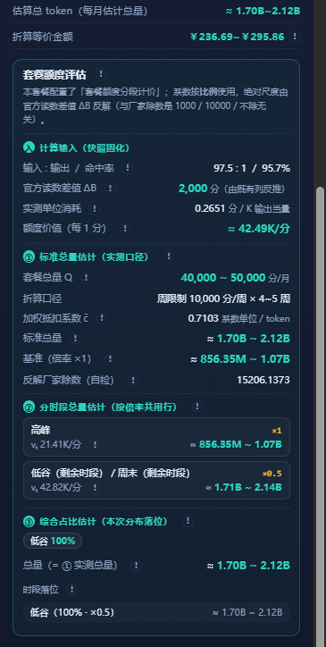

# my-kimicode-statistic
## 功能概述

统计你各个平台的token使用情况和命中率。
可以估算你不同 提供商套餐 按照某个模型计算，可以实际使用的token总量。

**强调说明：** 估计算法会考虑 **「输入:输出」**、**命中率**，以及你的 **时间段使用习惯**（针对分段计价的套餐），估算出真实的 token 额度总量。

完全离线统计，不读取任何敏感信息。（所以在使用“额度估计”功能时，需要手动输入 提供商的 额度信息）

## 新功能一览

### 平均每日 / 每小时消耗 与 固定悬浮面板（v0.37.0）

- **平均每日消耗**：拖动主页的「汇总范围」滑块框选任意一段日期后，打开「窗口汇总 · 详细」的饼图，左下角「总计」与「费用」行会以括号备注**平均每天**的用量与开销（如 `总计 18.38M（6.13M/天）`、`费用 ￥159.84（￥53.28/天）`）——token 单位按商值大小自适应（K/M/B），与总量单位无关；年视图按选中月份的自然天数计算（闰年正确）。只在「窗口汇总 · 详细」入口显示，点击单日 / 单月柱的下钻不受影响。
- **平均每小时消耗**：单日下钻的「按小时构成」区，按住柱体（或拖动时间轴）框选任意小时区间后，左侧「本范围构成」面板会为每个提供商 / 模型新增**「平均/h」列**——该维度在框选时段内的平均每小时消耗（自适应 K/M/B），配合总量与占比一眼看清时段习惯。
- **UI 交互优化（悬浮面板）**：柱状图与下钻饼图的悬浮信息从跟随鼠标的气泡升级为**固定位置的半透明卡片**——柱状图的面板会智能避让：始终停在鼠标的对侧，只有当鼠标几乎碰到面板边缘时才移动到另一边；饼图面板固定在图表左上角。鼠标移出图表（任意方向、任意速度）面板即隐藏。悬浮时柱体高亮提亮（附渐变光晕与坐标轴下划线标记）、饼图扇区提亮并描环，与「点击选中」的外移白边效果明确区分、可同时存在。


### 时间范围框选滑块（v0.34.0）

主页柱状图下方新增「汇总范围」双端滑动条：拖动两端手柄，把统计窗口框选到**任意一段日期（任意天数）**再汇总——拖动高亮段可整体平移、点轨道空白就近吸附（也支持键盘方向键 / Home / End）。框选后「窗口汇总」卡（输入 / 输出 / 总计 / 命中率）实时按选区重算，「窗口汇总 · 详细」的饼图同样跟随选区；柱状图同步以虚线框选并突出选中柱。右下角「恢复全窗口」一键复原；切换视图 / 平台 / 年份自动复位。详细交互见下方「界面预览」。



### 按小时统计下钻（v0.34.0）

点击柱状图查看单日「按提供商分布」饼图时，饼图下方会出现「按小时 · 提供商构成」：固定 24 小时堆叠柱（配色与对应饼图扇区一致），下方双端时间轴可拖动框选任意小时区间（如 `06:00 ~ 22:00 · 16 小时`），实时汇总该时段的 命中 / 未命中 / 输出 / 总量 四格数据。

小时数据口径：从**安装（或升级启用）之日起**开始产生，之前的历史数据不会补产生；每小时统计随每日条目滚动**保留 30 天**，月度数据不受影响。



### 模型评分（v0.19.0）

顶栏「◫ 模型评分」进入**独立页面**：维护「评分标准」（可分组、排序，单位为百分比或数值）与「模型信息」（每个模型挂若干评分维度 = 选一条标准 + 填一个分值），主图按选定的评分标准把各模型分值**从高到低横向对比**；支持**按模型筛选**（OR / AND 两种匹配模式），只看关心的那几个模型。**开箱即内置一份真实评测数据**（26 个模型 / 101 条标准 / 838 个分值），页面内「↺ 恢复内置数据」可随时还原。



### 基准评比：多厂商模型同任务对比（v0.25.0 起）

用不同厂商 / 不同模型的套餐，跑**相同的对话和任务**，在「额度估计 → 记录」中把这些快照记录打上**相同的基准标签**，再点击标签即可打开「基准比较」横向评比：

- **可完成次数 n**：按该套餐一个月的估计总 token，能完整跑完这个任务多少次；
- **平均单次消耗 B / 效率倍数 r**：完成相同任务、达到同等质量时**谁的 token 更省**——自动取平均单次消耗最少的组合记为 `1.00×` 基准，其余都是它的倍数（越接近 1.00× 越省）；
- **单位货币产出 U**：每 1 单位套餐货币能换到多少 token，**谁的 token 质量（性价比）更高**一眼可比。

支持按 效率倍数 / 可完成次数 / 单位货币产出 三种排序，多币种可输入汇率统一换算比较；窗口内含逐次测试明细与公式区，便于核对。



### 额度记录列信息展示维度（v0.29.0）

「额度估计 → 记录」的条目直接给出**总 token / 命中率 / 输出占比**三列派生指标（配合基准标签），不用点开详情就能一眼判断每条记录的消耗结构与质量。


### 手动录入额度记录（v0.31.0）

不经过「启动 / 停止」也能录入额度记录：在没有适配器的工具、或别的设备上用过套餐之后，把**官方读数**与**用量数据**直接填进来，走与额度估计**完全相同的公式**算出快照落库——记录与统计版完全同构，同样能打基准标签、参与基准评比。



## 安装（本地编译安装）

需要 Node.js **≥ 22.13**（内置 `node:sqlite`，推荐 24+）。

```bash
# 方式一：克隆仓库后全局链接（推荐）
git clone https://github.com/BigMaoly/coder-cost-plan-statistic.git
cd coder-cost-plan-statistic
npm install          # 安装依赖
npm link             # 生成全局命令 my-kimicode-statistic

# 方式二：从本地目录直接全局安装
cd coder-cost-plan-statistic
npm install -g .

# 方式三：不安装，直接用 node 运行
cd coder-cost-plan-statistic
node bin/cli.mjs --help
```

安装后获得命令 `my-kimicode-statistic`；方式三可随时用 `node bin/cli.mjs …` 代替。

## 命令

实际上不需要cli来刷新，直接启动web就会完成一次刷新。
为了维持低性能开销，不会主动扫描，点击web右上角的刷新按钮即可刷新。

| 命令 | 说明 |
|---|---|
| `my-kimicode-statistic web` | 后台启动面板（0.0.0.0:18201 起，占用自动 +1），打印全部局域网地址后退出，不阻塞前台 |
| `my-kimicode-statistic web stop` | 停止后台服务 |
| `my-kimicode-statistic web status` | 查看运行状态与全部访问地址 |
| `my-kimicode-statistic data init` | 全量重建统计数据（首次安装时执行；清空后遍历全部可用平台全量扫描） |
| `my-kimicode-statistic data update` | 增量扫描 + 固化/归档维护（幂等，可随时执行） |
| `my-kimicode-statistic completions bash\|zsh` | 输出命令补全脚本，例如 `eval "$(my-kimicode-statistic completions bash)"` |

所有命令支持中文 `--help`。扫描摘要按工具分记；单个平台数据源缺失或失败只跳过并提示，不阻塞其余平台。

## 界面预览

启动：

```bash
my-kimicode-statistic web

# 输出下面的时你的局域网可以访问的ip地址和端口

统计面板已启动（后台运行，前台不阻塞）。可访问地址：
  http://127.0.0.1:18201
  http://192.168.1.1:18201   # 示例：局域网内其他设备可访问的本机地址
停止服务：my-kimicode-statistic web stop
```

---


每一个柱状体都可以点击查看详细使用情况。（注意：按 提供商 赛选状态时，无法点击柱状图查看详细）
柱状图下方两个统计区域，可以通过点击“详细”查看饼状图。

---

柱状图下方有「汇总范围」双端滑动条，可以把统计窗口框选到**任意一段日期（任意天数）**再汇总：拖动两端手柄收窄范围，拖动高亮段整体平移，点轨道空白就近吸附（也支持键盘方向键 / Home / End）；下方信息行显示当前区间（如 `08-31 ~ 09-06（7 / 30）`），右下角「恢复全窗口」一键复原。框选后「窗口汇总」卡（输入 / 输出 / 总计 / 命中率）实时按选区重算，「窗口汇总 · 详细」的饼图也跟随选区；柱状图同步用虚线框选并突出选中柱、削弱未选中柱（纯展示样式）。切换视图 / 平台 / 年份会自动复位全窗口。（截图见上方「新功能一览」）

---

点击「⟳ 刷新」按钮即可完成一键数据扫描刷新（多平台增量扫描 + 当日固化），目前支持统计：**Kimi Code**、**ZCode**、**DeepSeek Harness (dsh)**、**Codex CLI**。

关于两个平台的说明：

- **Claude Code**：Claude 官方的多数统计数据的关键参数不存在，目前没有写适配器，只有通过 **CC Switch（ccswitch）** 路由方式连接使用的数据才会被统计；
- **Codex**：可以直接统计，但是你切换提供商时，记得通过你配置中的 `model_provider` 参数区分提供商。但如果 Codex 走 CC Switch 路由方式连接，可能无法识别出不同的提供商。


## 设置说明


1. 第一个是用来添加“提供商”和“模型”的统一映射名称配置的。
  - 当你在不同工具中配置同一个提供商，或者配置了同一个提供商多种 url兼容接口时。
  - 当你的模型名字大小写不一，不同工具中显示方式不同时。
  - 当你向为提供商进行后续的套餐设置 和 token “等效价格” 估计。
  - 如果你希望把这些名字显示为统一的简短的提供商和模型名字。
  - 你就需要配置提供商。（例如：kimi、火山、阿里、GLM 等等)
2. 套餐，给已经配置好的提供商设置套餐和模型价格信息。
3. 模型价格模板，设置模型的价格模板，可以快速在套餐设置中使用这个价格模板。

### 提供商设置

你的同一个提供商接口，在不同工具中可能显示不同。
可以在这里把他们映射为同一个提供商，在统计时聚合显示。
同理，你的模型在不同模型中写法不同，但是也可以把他们的数据聚合显示。


你可以把你不需要显示的模型按照任意名字聚合显示。


### 套餐设置

点击「添加」后，选择一个你配置好的提供商——一个提供商对应一个套餐。


绑定提供商之后，就可以点击「添加套餐」填写套餐信息：


支持**百分比计费**和**积分制**。你甚至可以增加任意套餐——比如想要统计「100 元能用多久」，可以添加一个积分制的「100 元一个月、100 积分」的套餐。

套餐设置中还可以添加和配置模型的价格，支持**分段计价**和按**「星期」计价**：


可以点击「导入」按钮，导入你在「价格模板」中配置好的价格——这样就不需要为每个中转站提供商的同一个模型反复填写价格分段信息。

套餐配置中，「API 价格」用来统计和估算——按照你当前的命中率，如果用 API 直接调用价值多少钱：


而「套餐积分分段计价」针对于统计时的估算——按照你的命中率和使用时段，你的套餐可能实际等价多少 token。

「套餐积分分段计价」中，需要填写一个**基础模型抵扣**，并在分段时间配置中填写不同时间段的**倍率**。

### 模型价格模板

配置好价格模板后，可以在「套餐配置」中的「API 价格」设置里快速导入。多个提供商都可以使用，与名字无关。


点击「导出」时，会在 `~/.config/my-kimicode-statistic/model-price` 路径下**按照每个分组一个文件**导出你的模型价格配置信息；备份按「最多保留 3 个相同配置」滚动删除。点击「导入」时会导入最新版本。

## 额度估计

「额度估计」可以记录你某个套餐在一定时间段的使用情况，根据你填入的官方**启动时的积分**和**停止时的积分**，估算你的套餐实际使用可以等效于多少 token 用量。


它分为**模型模式**和**非模型模式**——模型模式就是只统计某一个模型的使用情况。

点击「添加」创建一个配置，选中提供商和套餐，填入你在官方查询到的当前剩余额度（或已使用额度）。点击「开始」（开始前最好先刷新一次数据），然后去跑你的项目；跑完后回来点击「停止」，填入官方显示的剩余额度或新的已使用额度，就会在「额度估计 → 记录」中估计出你的套餐等效的 token。


注意：每次统计都是根据你的命中率、输入输出比例进行推算，所以你用得越多、命中率越准确；可能看到 token 记录多的统计记录、价值的 API 金额反而低，这是正常现象。

「剩余额度模式」填写的是你剩余的额度，通常用来评估你充值的金额。此时你可以创建一个自定义套餐（积分 = 包月费用），启动和结束时填写你的余额，就可以统计你的「100 元」可以用多少 token。


在「记录」页面中点击记录，可以看到对你这套餐**本次统计的消耗和 API 消耗估价**，以及对套餐**一个月总 token 的估计**。


查看一条记录的详情时，可以看到本次统计的**综合估分结果**。



对于套餐配置中开启了**分段统计**的套餐，估分会结合套餐在不同时段、不同模型上的使用比例和习惯进行推算——即按照你的时间分配比例和模型用量比例（非模型模式统计时显示），估计出你的套餐总共可以用多少 token。

其中「标准总量估计」部分的**标准总量**，是结合当前实际命中率、输入输出比以及各模型的使用比例，计算出的月套餐 token 量估计；**基准**则按 1 倍基础倍率（不含闲时折扣）给出基础参考 token 总量。

**分段总量**的含义是：沿用你当前的使用习惯（模型使用比例、命中率、输入输出量），假设你的全部积分都集中在某一个时段里消耗，这些积分会价值多少 token。

**综合估计**与标准总量本质上是同一个结果，只是出于不同维度的显示与比较需要，设计了两个展示位置。

## 功能更新

近期版本（v0.25.0 ~ v0.27.0）新增与修复：

- **额度统计任务基准**：在「额度估计 → 记录」中可以把快照标记为某个「任务基准」，并有专门的基准配置页按分组管理基准，记录页支持按基准筛选。
- **基准比较**：在记录页点击基准标签，会把全库同名基准的记录按「套餐 + 模型」分组取均值，横向比较不同套餐、不同模型下你的实际等效 token 表现。
- **快照记录备注**：快照详情支持行内编辑备注（失焦或回车自动保存，Esc 还原，清空即删除备注），方便记录每次统计任务的背景说明。
- **修复**：DeepSeek Harness（dsh）适配器此前会漏扫部分子代理会话，现已修复，增量扫描即可补齐。


