# my-kimicode-statistic
## 功能概述

统计你各个平台的token使用情况和命中率。
可以估算你不同 提供商套餐 按照某个模型计算，可以实际使用的token总量。

完全离线统计，不读取任何敏感信息。（所以在使用“额度估计”功能时，需要手动输入 提供商的 额度信息）

## 安装（本地编译安装）

需要 Node.js **≥ 22.13**（内置 `node:sqlite`，推荐 24+）。

```bash
# 方式一：克隆仓库后全局链接（推荐）
git clone https://github.com/BigMaoly/coder-cost-plan-statistic.git
cd coder-cost-plan-statistic
npm install          # 安装依赖
npm link             # 生成全局命令 my-kimicode-statistic

# 方式二：从本地目录直接全局安装
cd coder-cost-plan-statistic
npm install -g .

# 方式三：不安装，直接用 node 运行
cd coder-cost-plan-statistic
node bin/cli.mjs --help
```

安装后获得命令 `my-kimicode-statistic`；方式三可随时用 `node bin/cli.mjs …` 代替。

## 命令

实际上不需要cli来刷新，直接启动web就会完成一次刷新。
为了维持低性能开销，不会主动扫描，点击web右上角的刷新按钮即可刷新。

| 命令 | 说明 |
|---|---|
| `my-kimicode-statistic web` | 后台启动面板（0.0.0.0:18201 起，占用自动 +1），打印全部局域网地址后退出，不阻塞前台 |
| `my-kimicode-statistic web stop` | 停止后台服务 |
| `my-kimicode-statistic web status` | 查看运行状态与全部访问地址 |
| `my-kimicode-statistic data init` | 全量重建统计数据（首次安装时执行；清空后遍历全部可用平台全量扫描） |
| `my-kimicode-statistic data update` | 增量扫描 + 固化/归档维护（幂等，可随时执行） |
| `my-kimicode-statistic completions bash\|zsh` | 输出命令补全脚本，例如 `eval "$(my-kimicode-statistic completions bash)"` |

所有命令支持中文 `--help`。扫描摘要按工具分记；单个平台数据源缺失或失败只跳过并提示，不阻塞其余平台。

## 界面预览

启动：

```bash
my-kimicode-statistic web

# 输出下面的时你的局域网可以访问的ip地址和端口

统计面板已启动（后台运行，前台不阻塞）。可访问地址：
  http://127.0.0.1:18201
  http://192.168.1.1:18201   # 示例：局域网内其他设备可访问的本机地址
停止服务：my-kimicode-statistic web stop
```

---

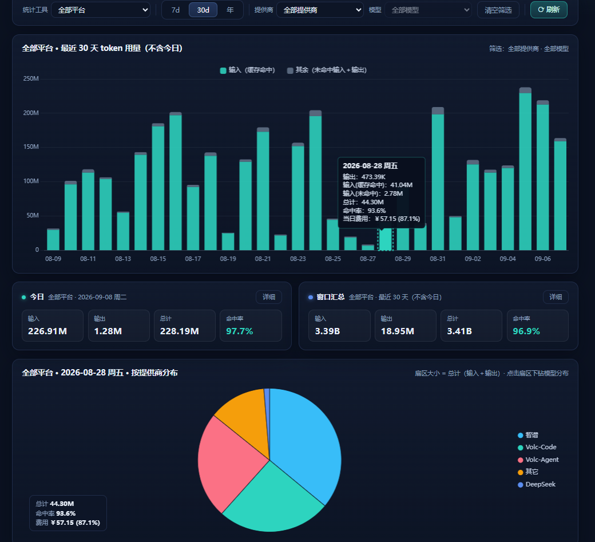

每一个柱状体都可以点击查看详细使用情况。（注意：按 提供商 赛选状态时，无法点击柱状图查看详细）
柱状图下方两个统计区域，可以通过点击“详细”查看饼状图。

---

点击「⟳ 刷新」按钮即可完成一键数据扫描刷新（多平台增量扫描 + 当日固化），目前支持统计：**Kimi Code**、**ZCode**、**DeepSeek Harness (dsh)**、**Codex CLI**。

关于两个平台的说明：

- **Claude Code**：Claude 官方的多数统计数据的关键参数不存在，目前没有写适配器，只有通过 **CC Switch（ccswitch）** 路由方式连接使用的数据才会被统计；
- **Codex**：可以直接统计，但是你切换提供商时，记得通过你配置中的 `model_provider` 参数区分提供商。但如果 Codex 走 CC Switch 路由方式连接，可能无法识别出不同的提供商。

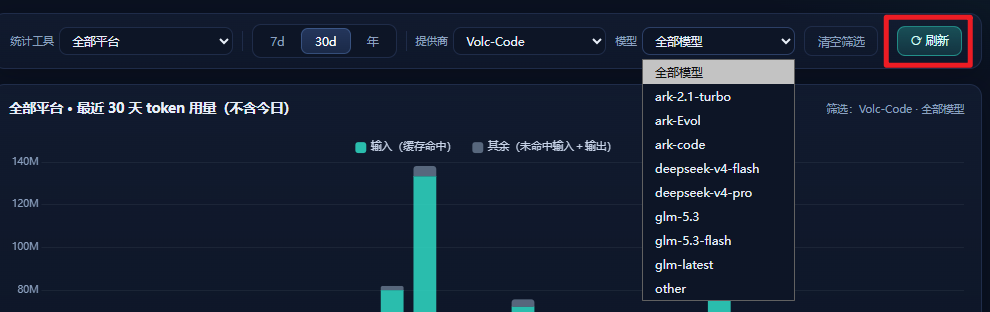

## 设置说明


1. 第一个是用来添加“提供商”和“模型”的统一映射名称配置的。
  - 当你在不同工具中配置同一个提供商，或者配置了同一个提供商多种 url兼容接口时。
  - 当你的模型名字大小写不一，不同工具中显示方式不同时。
  - 当你向为提供商进行后续的套餐设置 和 token “等效价格” 估计。
  - 如果你希望把这些名字显示为统一的简短的提供商和模型名字。
  - 你就需要配置提供商。（例如：kimi、火山、阿里、GLM 等等)
2. 套餐，给已经配置好的提供商设置套餐和模型价格信息。
3. 模型价格模板，设置模型的价格模板，可以快速在套餐设置中使用这个价格模板。

### 提供商设置

你的同一个提供商接口，在不同工具中可能显示不同。
可以在这里把他们映射为同一个提供商，在统计时聚合显示。
同理，你的模型在不同模型中写法不同，但是也可以把他们的数据聚合显示。

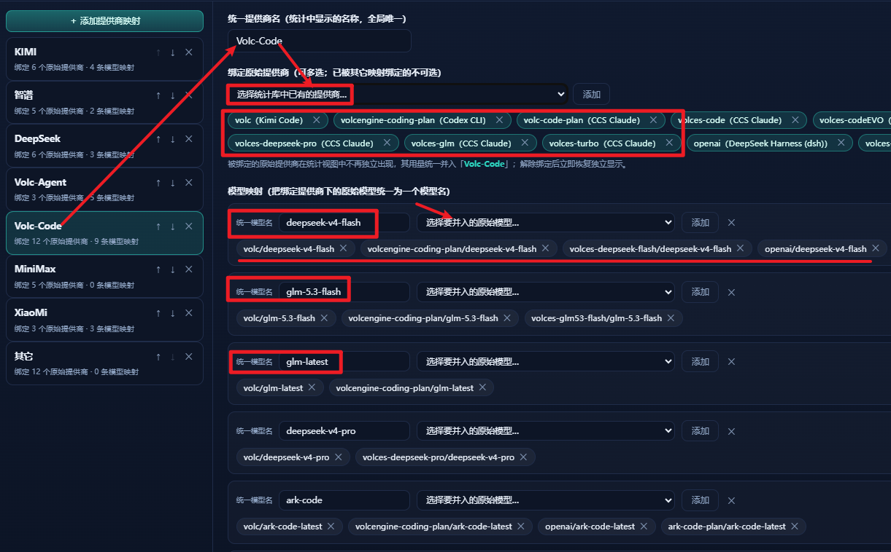

你可以把你不需要显示的模型按照任意名字聚合显示。

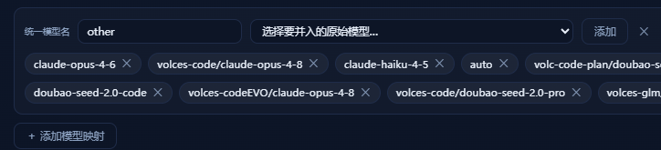

### 套餐设置

点击「添加」后，选择一个你配置好的提供商——一个提供商对应一个套餐。

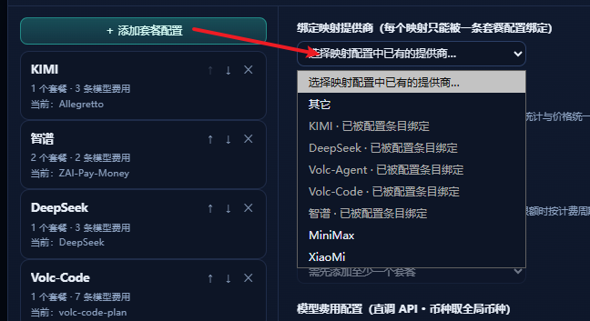

绑定提供商之后，就可以点击「添加套餐」填写套餐信息：

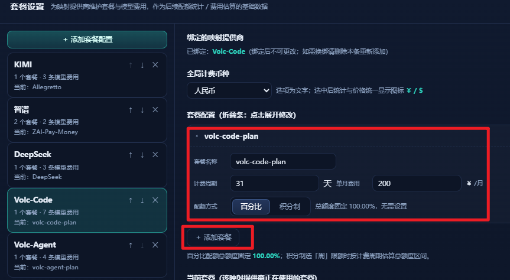

支持**百分比计费**和**积分制**。你甚至可以增加任意套餐——比如想要统计「100 元能用多久」，可以添加一个积分制的「100 元一个月、100 积分」的套餐。

套餐设置中还可以添加和配置模型的价格，支持**分段计价**和按**「星期」计价**：

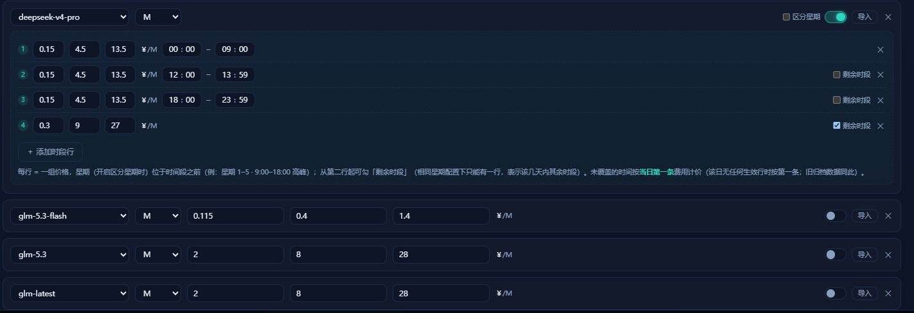

可以点击「导入」按钮，导入你在「价格模板」中配置好的价格——这样就不需要为每个中转站提供商的同一个模型反复填写价格分段信息。

套餐配置中，「API 价格」用来统计和估算——按照你当前的命中率，如果用 API 直接调用价值多少钱：

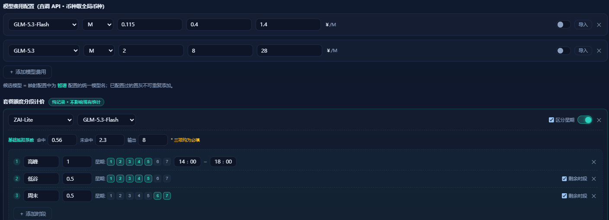

而「套餐积分分段计价」针对于统计时的估算——按照你的命中率和使用时段，你的套餐可能实际等价多少 token。

「套餐积分分段计价」中，需要填写一个**基础模型抵扣**，并在分段时间配置中填写不同时间段的**倍率**。

### 模型价格模板

配置好价格模板后，可以在「套餐配置」中的「API 价格」设置里快速导入。多个提供商都可以使用，与名字无关。

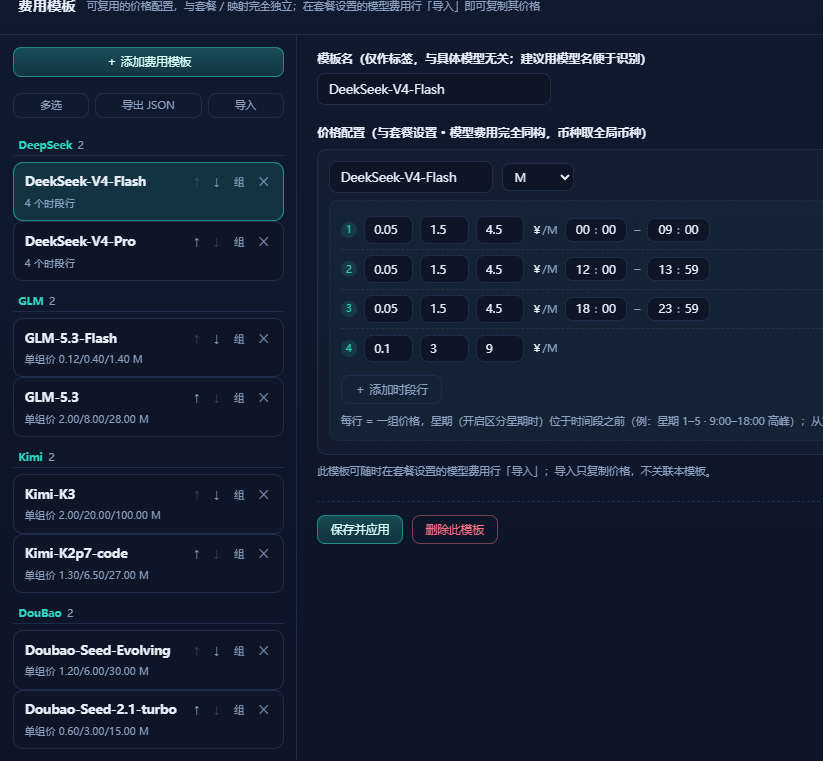

点击「导出」时，会在 `~/.config/my-kimicode-statistic/model-price` 路径下**按照每个分组一个文件**导出你的模型价格配置信息；备份按「最多保留 3 个相同配置」滚动删除。点击「导入」时会导入最新版本。

## 额度估计

「额度估计」可以记录你某个套餐在一定时间段的使用情况，根据你填入的官方**启动时的积分**和**停止时的积分**，估算你的套餐实际使用可以等效于多少 token 用量。

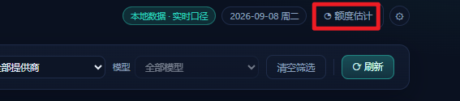

它分为**模型模式**和**非模型模式**——模型模式就是只统计某一个模型的使用情况。

点击「添加」创建一个配置，选中提供商和套餐，填入你在官方查询到的当前剩余额度（或已使用额度）。点击「开始」（开始前最好先刷新一次数据），然后去跑你的项目；跑完后回来点击「停止」，填入官方显示的剩余额度或新的已使用额度，就会在「额度估计 → 记录」中估计出你的套餐等效的 token。

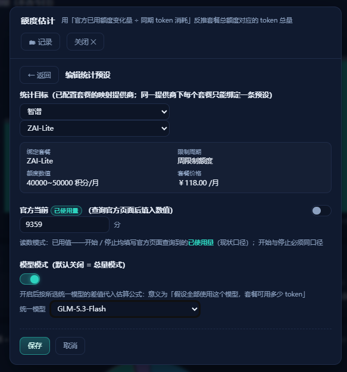

注意：每次统计都是根据你的命中率、输入输出比例进行推算，所以你用得越多、命中率越准确；可能看到 token 记录多的统计记录、价值的 API 金额反而低，这是正常现象。

「剩余额度模式」填写的是你剩余的额度，通常用来评估你充值的金额。此时你可以创建一个自定义套餐（积分 = 包月费用），启动和结束时填写你的余额，就可以统计你的「100 元」可以用多少 token。

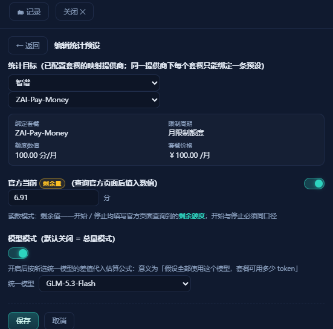

在「记录」页面中点击记录，可以看到对你这套餐**本次统计的消耗和 API 消耗估价**，以及对套餐**一个月总 token 的估计**。

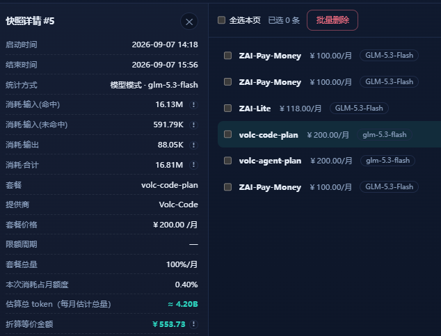


